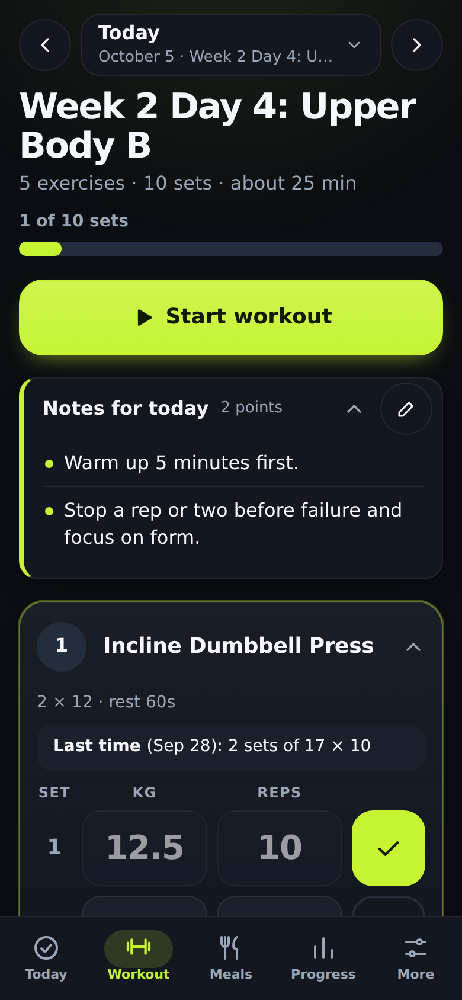
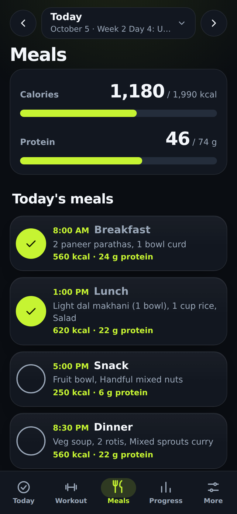
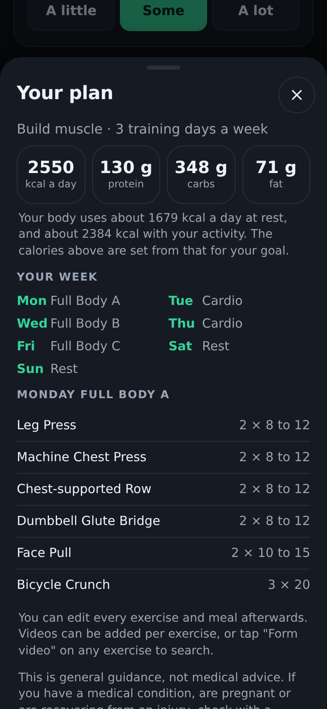
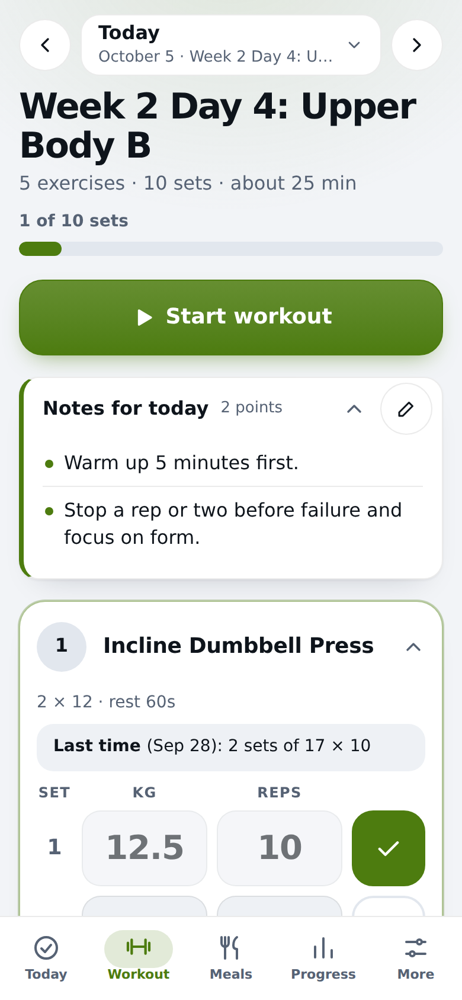

# TickFit

**A free gym and meal tracker that lives on your phone.** Follow any workout and meal plan as a simple daily checklist, log your sets, and build a plan from your own details. No account, no backend, no tracking, no subscription. It works offline and installs like an app on iPhone and Android.

> Built to share with friends so nobody has to pay for a fitness app.

<p>
  
  
  
</p>
<p>
  
  
  
</p>

## What it does

- **Today:** a calm summary. A progress ring, your streak, a week strip with completion dots, one big **Start workout** button, your meals at a glance and water. Tap the day title to jump to any day of the plan.
- **Workout mode:** one screen, no pop-ups. Every exercise is listed, the one you are on is open with a row for each set and big weight and reps boxes. Tick a set and the next exercise opens by itself. A clock runs while you train (it even starts on your first ticked set), and **Finish workout** shows your time, sets and total weight lifted. Boxes are pre-filled from the last time you did that exercise ("Last time (Sep 27): 3 sets of 22.5 × 10").
- **Notes you can edit:** the day's notes on the Workout screen are laid out as a tidy list (labels in bold, safety warnings in their own box) and collapse when long. Tap the pencil to edit them, hit **Tidy up into points** to auto-arrange your own text, and choose to save for just that day or every day that has the same note.
- **Meals:** calories and protein meters, each meal as a big tick tile, supplements and water.
- **Calories and protein for any meal:** in the plan editor type them yourself, or tap **Estimate from foods**. It reads lines like `2 rotis`, `100 g paneer` or `1 or 2 bananas` against a built-in table of common Indian foods, fully offline. Optional: in **More > Food lookup** you can let it look up unfamiliar foods online (Open Food Facts, no key). Off by default; only the food name is sent.
- **Rest timer:** starts by itself after each finished set (you can switch that off), with +15s, skip, beep and vibration. It sits at the top of the screen and pushes the page down instead of covering it.
- **Form videos:** each exercise can carry a video link. If it doesn't, the **Form video** button opens a YouTube search for that exercise.
- **Build a plan for you:** answer a few questions (age, height, weight, goal, experience, days a week, where you train, session length, cardio, diet, injuries). The diet can be the same every day, **Mixed** (your main diet with non-veg on a few evenly spread days), or **picked per day** (for example vegan Monday, egg Wednesday, non-veg Sunday) and TickFit builds a full weekly workout and Indian meal plan on your phone, with calories and protein worked out for you. No internet or AI needed.
- **Or bring any plan:** paste JSON, upload a PDF or text file, or let a free chatbot convert your document. Friendly errors tell you exactly what is wrong ("Day 3 is missing meals").
- **Progress:** streak, last 7 day completion and a month calendar. Tap a day to open it.
- **Daily weight tracker:** tap the Weight tile on Today to log your weight (big number, +/- 0.1 buttons). Progress shows a chart (30 or 90 days), your 7 day average and how much you gained or lost versus last week. The average matters more than any one day, because weight swings a kilo or two with water and food.
- **Calories per exercise:** every exercise has an effort level (lifting about 5 to 6 METs, a run about 9, a walk about 4, stretching 2.5). TickFit estimates what each exercise burnt from that, your body weight and the time it took (timed work like "30 min" uses its real time; the workout clock is used when you finish). The finish summary shows the total and each exercise, and cardio gets its own line.
- **Weekly and monthly summary:** estimated calories burnt, workouts, training time, sets, total weight lifted, a bar per day, comparison with the previous week or month, your heaviest lift per exercise (with new bests), and daily averages for calories, protein and water. Calories use the MET method (5 METs for lifting x your body weight x workout time), so treat them as a rough guess. Body weight comes from your plan builder answers, or set it right there.
- **Plans in one place:** **More > My plan** to switch, edit or add a plan. First-time visitors get a short welcome with three clear choices: build a plan for me, I already have one, or show me around with the sample.
- An **editor** for every exercise, meal and extra.
- **Keeps your data safe:** asks the browser to protect your data, nudges you to back up once a day (one tap, also offered after a workout, with a red dot on More when it is overdue), and makes moving to a new phone easy (see below).
- **Dark by default**, with light and match-my-phone themes. Smooth, quick animations (screens glide in, ticks pop, progress fills up, light haptics in the Android app) that switch off if your phone is set to reduce motion. Works offline after the first load.
- **After a workout**, a pop-up offers to back up your progress (once a day, and you can turn it off in More).
- A built in **4 week beginner plan with vegetarian Indian meals**, so it is useful on first open.

## Privacy

Everything stays on your device. There is no server to send anything to. See [PRIVACY.md](PRIVACY.md) for the details, including the one optional feature (Gemini) that does send your document text to Google if you choose to turn it on.

## How to use it

1. **Open the app.** First time, pick how to start: **Build a plan for me**, **I already have a plan**, or **Just show me around** (a 4 week sample).
2. **Train.** On **Today** tap **Start workout**. Tick each set as you do it. When you finish an exercise the next one opens. Tap **Finish workout** for your summary.
3. **Eat.** Tick meals off on the **Meals** tab, and tap **+** on the water tile through the day.
4. **Check your progress** on the **Progress** tab, and use **More** to manage plans, themes, backups and settings.

### Install it on your phone

- **Android app (APK):** download the latest from the [Releases page](https://github.com/PredatorWoah/TickFit/releases/latest). A complete app with everything inside it, so it works with no internet. How it is made: [docs/ANDROID.md](docs/ANDROID.md).
- **iPhone (Safari):** Share button, then **Add to Home Screen**.
- **Android (Chrome):** menu, then **Install app** (or **Add to Home screen**).

After that it opens full screen and works without internet. On an iPhone this also matters for your data: Safari can erase a website's data after about a week of not opening it, but an installed app is safe from that.

## Your data: where it lives and how not to lose it

TickFit stores everything in your browser on your phone. That is what makes it private, free and offline. It also means there is no account to recover from, so:

- **Install it** to your Home Screen (see above). Installed apps are far less likely to have their data cleared.
- **Back up daily.** A web page cannot save files by itself (no browser allows it), so TickFit makes it as easy as possible: a reminder on Today once a day, a one tap **Back up now** sheet, and a red dot on the More tab when your backup is 3 days old. In the sheet you can rename the file, share it (save to Files or Drive, send it on WhatsApp or email) or download it. Android and iPhone cannot overwrite an old file, so a repeated name becomes "name (1)"; desktop Chrome and Edge can use **Save over an existing file**.
- **New phone?** Make a backup on the old phone, open the same link on the new one, then **More > Restore from a backup file**. Your Gemini key (if you set one) is never in the backup, on purpose.
- **Two devices do not sync.** Without a server that isn't possible, so each device keeps its own history.

## Build a plan from your details

**More > My plan > New plan > Build one for me.** You answer about a dozen taps and numbers, see a preview (daily calories and protein, the week, a sample workout), and then create the plan.

How it works, so you can judge it:

- **Calories:** your resting energy from the Mifflin-St Jeor formula, multiplied for how active you are and how often you train, then adjusted for your goal (about 20% less to lose fat, a small surplus to build muscle). It never goes below 1,200 kcal (women) or 1,500 (men) for fat loss, and it holds calories at maintenance instead of cutting them if you are under 18 or your BMI is low.
- **Protein:** about 1.4 to 2 g per kg depending on the goal, from a sensible reference weight.
- **Workouts:** a split that fits your days (full body, upper/lower, push/pull/legs), exercises chosen for your equipment, with beginner-friendly picks first (leg press before barbell squats). Bad knees, lower back or shoulders remove the exercises that stress them.
- **Meals:** Indian home cooking for vegetarian, eggetarian, non-veg or vegan eaters, with portions sized so each meal's calories and protein add up. The meals are real estimates of typical home portions, not lab values.
- **It is a starting point.** You can edit every exercise and meal afterwards. This is general guidance, not medical advice: if you have a medical condition, are pregnant or are recovering from an injury, check with a doctor first.

Prefer to let a chatbot design it? **Or copy a prompt for a chatbot** copies the same details as a ready prompt.

## The AI prompt workflow (for your own documents)

You do not need to write JSON by hand. Any free chatbot can convert a plan document for you:

1. In TickFit, open **More > New plan > Paste or upload a plan** and tap **Copy AI prompt**.
2. Open any chatbot (ChatGPT, Gemini, Claude, Copilot, anything free). Paste the prompt, then paste your plan document under it. For a PDF from your trainer or dietitian, tap **Upload PDF or text** in TickFit to extract its text on your phone, then **Copy prompt with this text**.
3. The chatbot replies with JSON. Copy the whole reply.
4. Paste it into TickFit's box and tap **Import plan**. Stray text and code fences around the JSON are handled for you.

If something is wrong, TickFit lists every problem in plain language. Paste that back to the chatbot and ask it to fix it.

**Optional one tap version:** with a free [Google Gemini API key](https://aistudio.google.com/) in **More > AI helper**, **Convert with Gemini** replaces the copy and paste. Read the warnings on that screen first: your document text is sent to Google, and the key is stored (unencrypted) in your browser.

## Plan format

Plans are plain JSON. Rest days have an empty `workout` list.

```json
{
  "name": "Beginner Muscle Plan",
  "days": [
    {
      "label": "Monday Push",
      "workout": [
        { "exercise": "Bench Press", "sets": 3, "reps": "8 to 10", "rest": "90s", "weight": "20 kg", "notes": "", "video": "https://youtu.be/example" }
      ],
      "meals": [
        { "time": "8:00 AM", "name": "Breakfast", "items": ["Paneer bhurji", "2 rotis"], "calories": 450, "protein": 25 }
      ],
      "extras": { "waterLiters": 3, "supplements": ["Creatine 5g"], "notes": "" }
    },
    {
      "label": "Tuesday Rest",
      "workout": [],
      "meals": [{ "name": "Breakfast", "items": ["Poha"] }]
    }
  ]
}
```

| Field | Required | Notes |
| --- | --- | --- |
| `name` | no | Defaults to "Imported plan" |
| `days[].label` | no | Defaults to "Day N" |
| `days[].workout` | **yes** | `[]` for a rest day |
| `days[].meals` | **yes** | Can be `[]` |
| `workout[].exercise` | **yes** | `sets`, `reps`, `rest`, `weight`, `notes`, `video` are optional |
| `workout[].weight` | no | A target like `"20 kg"` or `"bodyweight"`. Pre-fills the weight in the set sheet |
| `workout[].video` | no | A web link (`https://...`). Anything else is ignored with a warning |
| `meals[].name`, `meals[].items` | **yes** | `time`, `calories`, `protein` are optional |
| `extras` | no | `waterLiters`, `supplements` (list), `notes` |

There are two kinds of plan:

- **Cycle (default):** Day 1 is your start date, Day 2 the next day, and so on, repeating after the last day. The built in sample works like this.
- **Weekly:** if **every** day label starts with a weekday (`"Monday Chest + Triceps"`, `"Tue: Back"`), the plan follows the real calendar instead. A Monday shows the Monday entry, and weekdays you don't list (say Sunday in a Monday to Saturday plan) are rest days. No start date is needed, and a 6 day plan no longer drifts. Plans built by the builder are weekly plans.

Rest days with nothing to tick never break your streak. The `reps` text decides how an exercise is logged: a rep count like `8 to 10` gives weight and reps boxes, a timed one like `30 sec` or `30 min` gives a simple tick. The `rest` text feeds the timer: `90s`, `2 min`, `1:30` and `60 to 90s` all work.

The importer is forgiving: it accepts code fences, chatty text around the JSON, trailing commas, curly or single quotes, unquoted keys, and numbers written as text.

## Fork it and make it yours

There is no build step, so forking is easy:

1. Click **Fork** on GitHub.
2. Edit files right in the GitHub web editor, or clone and open the folder in any editor.
3. Change the colours in `css/styles.css`, the sample plan in `data/sample-plan.json`, the name in `index.html` and `manifest.webmanifest`, and the icons in `icons/`.
4. Host it (below).

To run it on your computer: `python3 -m http.server 8000`, then open http://localhost:8000. (Opening `index.html` directly will not work, because browsers block modules and service workers on `file://`.)

## Host it free on GitHub Pages

**Easiest (works in any fork, no setup files needed):**

1. Fork this repo.
2. Go to **Settings > Pages**.
3. Under **Build and deployment**, set **Source** to **Deploy from a branch**, branch **main**, folder **/ (root)**, and save.
4. After a minute your app is at `https://YOUR-USERNAME.github.io/REPO-NAME/`.

**With GitHub Actions** (this repo's own setup): in **Settings > Pages**, set **Source** to **GitHub Actions**. The workflow in `.github/workflows/pages.yml` then runs the tests and deploys on every push to `main`.

All paths in the app are relative, so it works under any `/REPO-NAME/` address.

## Updates (why a deploy shows up straight away)

GitHub Pages lets browsers keep each file for 10 minutes, so a plain refresh could show the old app (or a mix of old and new files) for a while after a deploy. To avoid that, the deploy workflow runs `node scripts/stamp.mjs`, which adds the commit ID to every file URL in the `_site` copy (`app.js?v=abc1234`). Your source files are never changed. The service worker also asks the server before reusing a file, an installed app that is resumed (not reloaded) gets a "TickFit has a new version, Reload" bar, and **More > App version > Update TickFit now** forces the newest files without touching your data.

## Tests

```
node tests/all.mjs
```

No installs needed. It covers the plan importer (valid, messy and broken inputs), weekday scheduling, streaks, set logging, rest-time parsing, the backup reminder logic, the weekly and monthly summaries, calorie burn, note formatting, mixed and per-day diets, the body weight maths, the food estimate and the opt-in lookup (with a faked network), the offline file list, and the plan builder: the builder test generates **2,700 plans across every combination of answers** and checks each one is valid, uses only the equipment you have, avoids exercises that stress your injuries, respects your diet, stays close to its calorie target and varies day to day. See [CONTRIBUTING.md](CONTRIBUTING.md).

## Contributing

Small, focused changes are welcome. Please read [CONTRIBUTING.md](CONTRIBUTING.md) first (the short version: no build step, no tracking, phone first, comment for beginners).

## Credits and license

[MIT](LICENSE). PDF reading uses a bundled copy of [pdf.js](https://github.com/mozilla/pdf.js) (Apache-2.0), see `vendor/pdfjs/`.

TickFit is not medical advice. Check your plan with a qualified professional.
