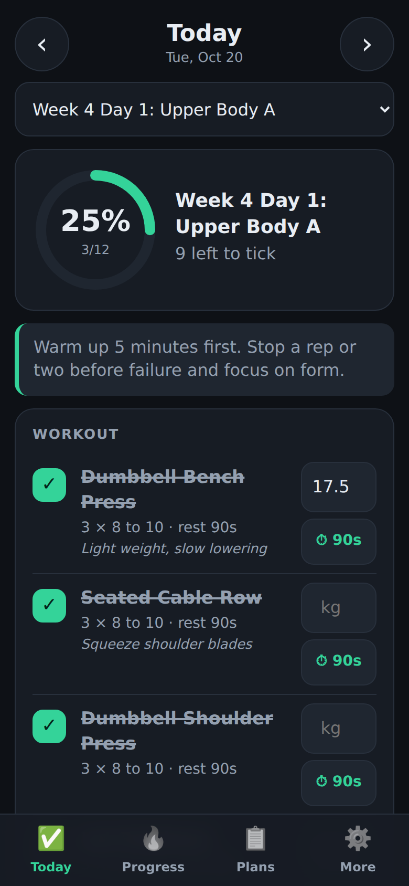
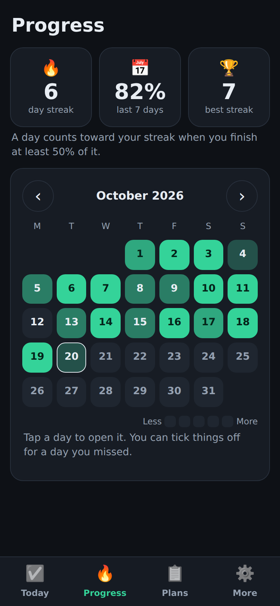
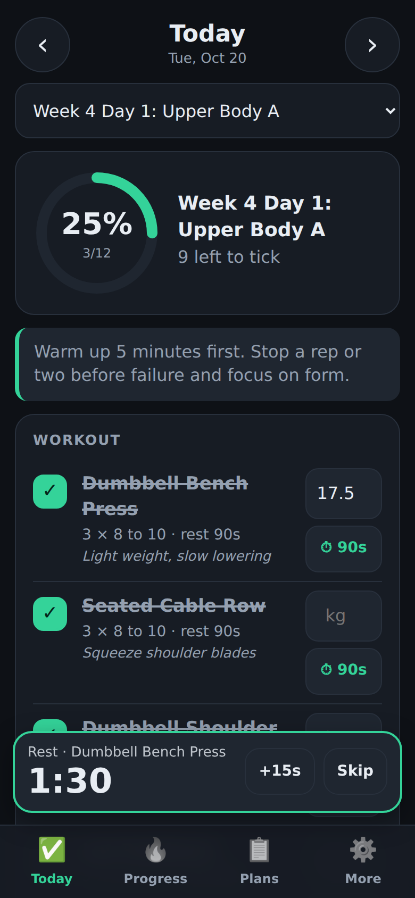
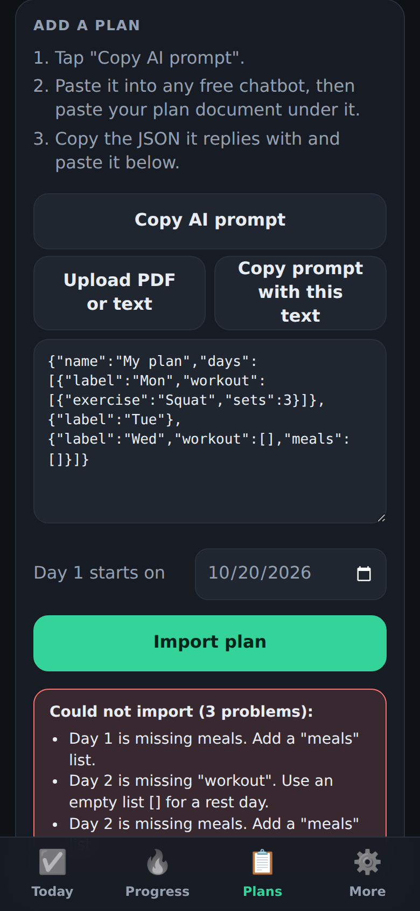
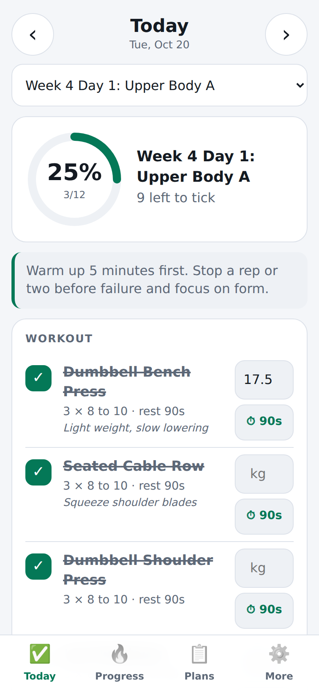

# TickFit

**A free gym and meal checklist that lives on your phone.** Turn any workout and meal plan into a daily tap-to-tick list. No account, no backend, no tracking, no subscription. It works offline and installs like an app on iPhone and Android.

> Built to share with friends so nobody has to pay for a fitness app.

<p>
  
  
  
</p>
<p>
  
  
</p>

## What it does

- **Today screen:** your workout and meals as big tappable checklists, a progress ring, water tracker, supplements and notes. It picks today's day automatically from your start date, and you can jump to any day.
- **Workouts:** exercise, sets, reps, rest and notes, plus an optional box to log the weight you used. A one tap rest timer with a beep.
- **Meals:** time, name, foods, optional calories and protein, with daily totals.
- **Progress:** streak, last 7 day completion, and a month calendar. Tap a day to open it.
- **Bring any plan:** paste JSON, upload a PDF or text file, or let a free chatbot do the conversion (see below). Friendly errors tell you exactly what is wrong ("Day 3 is missing meals").
- **Several plans** at once, with a switcher. **Edit** any plan after importing.
- **Backup:** export and import all your data as one JSON file.
- **Dark by default**, with light and match-my-phone themes.
- **Works offline** after the first load.
- A built in **4 week beginner plan with vegetarian Indian meals** (paneer, dal, curd, sprouts and so on) so it is useful on first open.

## Privacy

Everything stays on your device. There is no server to send anything to. See [PRIVACY.md](PRIVACY.md) for the details, including the one optional feature (Gemini) that does send text to Google if you choose to turn it on.

## How to use it

1. **Open the app.** On first open it loads the sample plan and you land on **Today**. Tap an item to tick it. Tap **⏱** next to an exercise to start its rest timer.
2. **Add your own plan:** go to **Plans**, then follow the AI workflow below.
3. **Check your progress** on the **Progress** tab, and make a **backup** under **More** now and then.

### Install it on your phone

- **iPhone (Safari):** Share button, then **Add to Home Screen**.
- **Android (Chrome):** menu, then **Install app** (or **Add to Home screen**).

After that it opens full screen and works without internet.

## The AI prompt workflow

You do not need to write JSON by hand. Any free chatbot can do it:

1. In TickFit, open **Plans** and tap **Copy AI prompt**.
2. Open any chatbot (ChatGPT, Gemini, Claude, Copilot, anything free). Paste the prompt, then paste your plan document under it. A PDF from your trainer or dietitian works: copy its text, or tap **Upload PDF or text** in TickFit to extract the text, then **Copy prompt with this text**.
3. The chatbot replies with JSON. Copy the whole reply.
4. Paste it into TickFit's box and tap **Import plan**. Stray text and code fences around the JSON are handled for you.

If something is wrong, TickFit lists every problem in plain language. Paste that back to the chatbot and ask it to fix it.

**Optional one tap version:** if you have a free [Google Gemini API key](https://aistudio.google.com/), you can add it under **More > AI helper** and use **Convert with Gemini** instead of copy and paste. Read the warnings on that screen first: your document text is sent to Google, and the key is stored (unencrypted) in your browser.

## Plan format

Plans are plain JSON. Rest days have an empty `workout` list.

```json
{
  "name": "Beginner Muscle Plan",
  "days": [
    {
      "label": "Day 1 Push",
      "workout": [
        { "exercise": "Bench Press", "sets": 3, "reps": "8 to 10", "rest": "90s", "notes": "" }
      ],
      "meals": [
        { "time": "8:00 AM", "name": "Breakfast", "items": ["Paneer bhurji", "2 rotis"], "calories": 450, "protein": 25 }
      ],
      "extras": { "waterLiters": 3, "supplements": ["Creatine 5g"], "notes": "" }
    },
    {
      "label": "Day 2 Rest",
      "workout": [],
      "meals": [{ "name": "Breakfast", "items": ["Poha"] }]
    }
  ]
}
```

| Field | Required | Notes |
| --- | --- | --- |
| `name` | no | Defaults to "Imported plan" |
| `days[].label` | no | Defaults to "Day N" |
| `days[].workout` | **yes** | `[]` for a rest day |
| `days[].meals` | **yes** | Can be `[]` |
| `workout[].exercise` | **yes** | `sets`, `reps`, `rest`, `notes` are optional |
| `meals[].name`, `meals[].items` | **yes** | `time`, `calories`, `protein` are optional |
| `extras` | no | `waterLiters`, `supplements` (list), `notes` |

The plan repeats after its last day (a 7 day plan is a weekly cycle). The `rest` text is read for the timer: `90s`, `2 min`, `1:30` and `60 to 90s` all work.

The importer is forgiving: it accepts code fences, chatty text around the JSON, trailing commas, curly or single quotes, unquoted keys, and numbers written as text.

## Fork it and make it yours

There is no build step, so forking is easy:

1. Click **Fork** on GitHub.
2. Edit files right in the GitHub web editor, or clone and open the folder in any editor.
3. Change the colours in `css/styles.css`, the sample plan in `data/sample-plan.json`, the name in `index.html` and `manifest.webmanifest`, and the icons in `icons/`.
4. Host it (below).

To run it on your computer: `python3 -m http.server 8000`, then open http://localhost:8000. (Opening `index.html` directly will not work, because browsers block modules and service workers on `file://`.)

## Host it free on GitHub Pages

**Easiest (works in any fork, no setup files needed):**

1. Fork this repo.
2. Go to **Settings > Pages**.
3. Under **Build and deployment**, set **Source** to **Deploy from a branch**, branch **main**, folder **/ (root)**, and save.
4. After a minute your app is at `https://YOUR-USERNAME.github.io/REPO-NAME/`.

**With GitHub Actions** (this repo's own setup): in **Settings > Pages**, set **Source** to **GitHub Actions**. The workflow in `.github/workflows/pages.yml` then runs the tests and deploys on every push to `main`.

All paths in the app are relative, so it works under any `/REPO-NAME/` address.

## Tests

```
node tests/all.mjs
```

No installs needed. The parser is tested against valid, messy and broken inputs (`tests/cases.js`). See [CONTRIBUTING.md](CONTRIBUTING.md).

## Contributing

Small, focused changes are welcome. Please read [CONTRIBUTING.md](CONTRIBUTING.md) first (the short version: no build step, no tracking, phone first, comment for beginners).

## Credits and license

[MIT](LICENSE). PDF reading uses a bundled copy of [pdf.js](https://github.com/mozilla/pdf.js) (Apache-2.0), see `vendor/pdfjs/`.

TickFit is not medical advice. Check your plan with a qualified professional.
